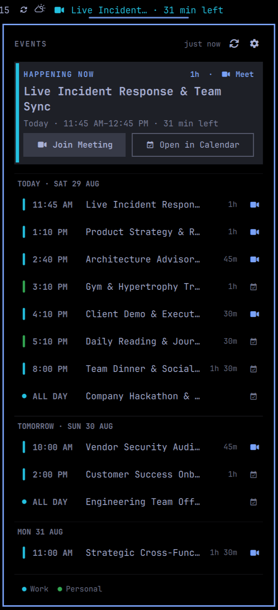
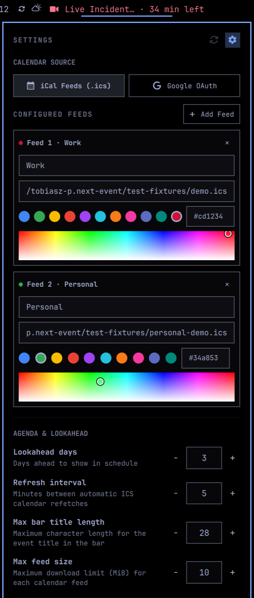
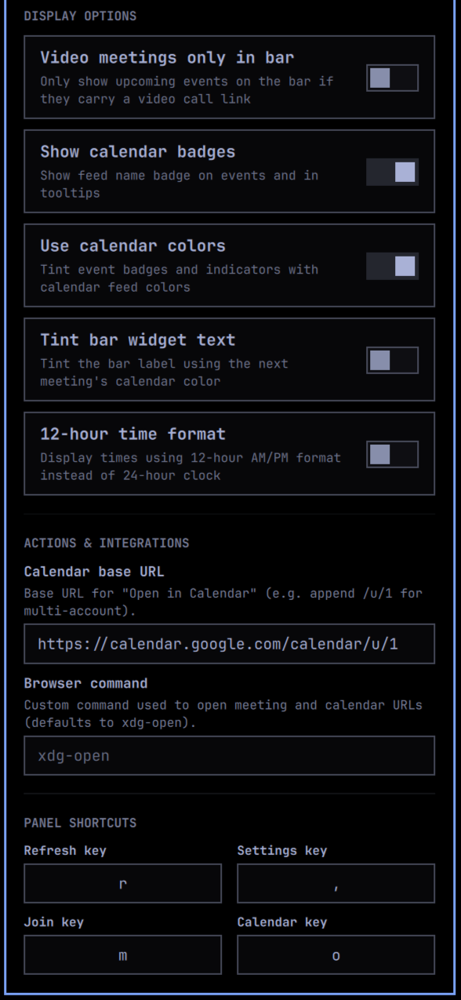
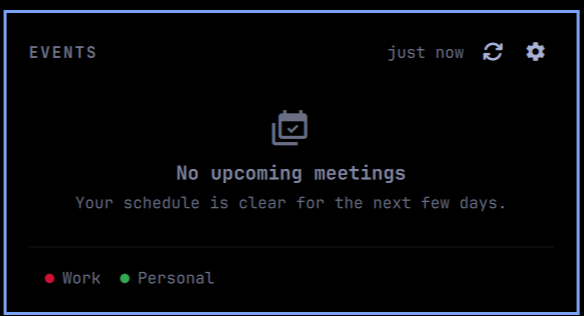
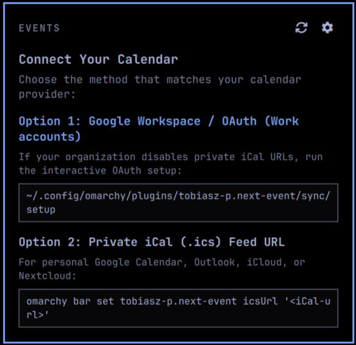
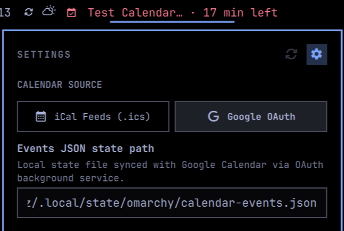

# NextEvent

[](https://github.com/tobiasz-p/next-event/actions/workflows/ci.yml)
[](https://omarchyplugins.com/plugin.html?id=tobiasz-p.next-event)
[](https://omarchy.org/)
[](LICENSE)
[](https://eslint.org)
[](https://github.com/prettier/prettier)

Next event, right in the bar — native to your Omarchy shell. Shows the next
upcoming event from your calendar with live countdowns and lets you join video calls (Google Meet, Zoom, Teams, Webex, GoToMeeting) with a single click.

## Contents

- [Screenshots](#screenshots)
- [Features](#features)
- [Install](#install)
- [Remove](#remove)
- [Setup & Calendar Connection](#setup--calendar-connection)
  - [Option 1: Google Workspace OAuth](#option-1-google-workspace-oauth-recommended-for-work-accounts)
  - [Option 2: Private iCal Feed URL](#option-2-private-ical-ics-feed-urls-personal-accounts)
- [Available Settings](#available-settings)
- [Opening the Panel from the Keyboard](#opening-the-panel-from-the-keyboard)
  - [Panel Keyboard Shortcuts](#panel-keyboard-shortcuts)
- [Privacy](#privacy)
- [Contributing](#contributing)
- [License](#license)

<p align="center">
  
  <br>
  <em>Active meeting with live countdown in the bar, hero card with Join Meeting action, per-feed color indicators, and multi-day grouped agenda</em>
</p>

## Screenshots

**Agenda**

<table align="center"><tr>
  <td align="center"><br><sub><b>Full agenda</b> — hero card, Join Meeting, per-feed color bars, all-day dots, section headers with dates, calendar legend</sub></td>
  <td align="center"><br><sub><b>12h AM/PM format</b> with bar text tinted in the active calendar's color</sub></td>
</tr></table>

**Settings**

<table align="center"><tr>
  <td align="center"><br><sub><b>iCal Feeds</b> — add/remove feeds, labels, 2D color spectrum picker, lookahead &amp; refresh</sub></td>
  <td align="center"><br><sub><b>Display &amp; shortcuts</b> — video filter, colors, bar tint, 12h format, calendar URL, browser command, panel keybindings</sub></td>
</tr></table>

**States & Onboarding**

<table align="center"><tr>
  <td align="center"><br><sub><b>Empty state</b> — schedule clear, legend shows configured feeds</sub></td>
  <td align="center"><br><sub><b>First-run onboarding</b> — OAuth or iCal URL</sub></td>
  <td align="center"><br><sub><b>Google OAuth source</b> — local JSON state file path</sub></td>
</tr></table>

## Features

- **Google Workspace OAuth & Universal Calendar Support**: Connect corporate Google Workspace accounts via guided OAuth setup, or use standard `.ics` feeds from Google Calendar, Microsoft Outlook, Apple iCloud, Nextcloud, Proton, and custom URLs
- **Multiple Calendars**: Combine several `.ics` feeds (e.g. work + personal) into one widget. Give each feed a `label|` name so events carry a small tag, shared events are deduplicated, and one offline calendar doesn't hide the rest
- **Bar Widget**: Shows the next event with live countdown (`Daily in 15 min`, `Daily · 15 min left`, `Daily · 14:00`, `Daily · Tmrw 14:00`, `Daily · Wed 14:00`). Set `timeFormat` to `12` for AM/PM times
- **Quick Join & Settings**: Click to open the agenda panel; single click on "Join Meeting" opens the video link (Google Meet, Zoom, Teams, Webex, GoToMeeting) in your default browser; click the Settings button next to Refresh (or press `,`) to customize all options directly in the UI
- **Instant Actions**: Right-click on the bar widget to join the next meeting immediately; middle-click to force-refresh
- **Keyboard Navigation**: With the agenda panel open, `↑`/`↓` (or `j`/`k`) move through the refresh and settings buttons, hero actions, and event rows, `Enter`/`Space` activates, `r` refreshes, `,` toggles settings, `m` joins the next meeting, `o` opens it in the calendar, `Tab`/`Shift+Tab` switch panels, `Escape` closes — all scoped to the focused panel so no Omarchy keybinding is ever shadowed
- **Summon Keybinding**: Bind a global key to open the agenda panel (see [Opening the panel from the keyboard](#opening-the-panel-from-the-keyboard))
- **Repeating Events**: Automatically expands repeating events (daily standups, weekly meetings) and respects cancelled or rescheduled instances
- **Live Updates**: Automatic background sync every few minutes, with a 30-second reactive countdown timer
- **Instant start**: ICS events reappear immediately from a local cache while calendars refresh in the background

## Install

```sh
omarchy plugin add https://github.com/tobiasz-p/next-event.git --enable
```

Or manually: copy this folder into `~/.config/omarchy/plugins/tobiasz-p.next-event` and run

```sh
omarchy plugin enable tobiasz-p.next-event
```

## Remove

```sh
omarchy plugin remove tobiasz-p.next-event
```

---

## Setup & Calendar Connection

NextEvent supports two calendar sources:

### Option 1: Google Workspace OAuth (Recommended for Work Accounts)

In many Google Workspace organizations, administrators disable the "Secret address in iCal format" / private ICS sharing for security policies. NextEvent includes guided OAuth onboarding:

```sh
~/.config/omarchy/plugins/tobiasz-p.next-event/sync/setup
```

#### Why bring your own OAuth credentials?
`calendar.readonly` is a Google *sensitive scope*. Distributing a shared client ID would require Google verification and is capped at 100 test users with 7-day token expiration. By creating your own personal Google Cloud project and Desktop OAuth Client:
- You own the app credentials directly.
- Refresh tokens work indefinitely without expiring every 7 days.
- Workspace domain policies that block public/secret `.ics` feeds are bypassed safely.

The setup script automates GCP project creation, Google Calendar API enablement, the OAuth login, and installs a systemd user timer to automatically sync events into `~/.local/state/omarchy/calendar-events.json` every 5 minutes.

---

### Option 2: Private iCal (.ics) Feed URL(s) (Personal Accounts)

For personal accounts (Google Calendar, Outlook, iCloud, Nextcloud, Fastmail):

```sh
omarchy bar set tobiasz-p.next-event icsUrl '<your-private-ics-url>'
```

#### Multiple calendars & Custom Colors

`icsUrl` accepts more than one feed. Combine feeds with a comma, and optionally
specify a label and color (e.g. `Label|#HEX|url` or `Label|url` or `#HEX|url`). If no color is specified, NextEvent automatically assigns a distinct, attractive palette color:

```sh
omarchy bar set tobiasz-p.next-event icsUrl 'Work|#4285f4|https://…/work.ics,Personal|#34a853|https://…/personal.ics'
```

A single unlabeled feed still works seamlessly:

```sh
omarchy bar set tobiasz-p.next-event icsUrl 'https://…/single.ics'
```

For URLs that themselves contain a comma or `|`, use a JSON array of objects
instead (useful when editing `shell.json` directly):

```json
[{"url":"https://…/work.ics","label":"Work","color":"#4285f4"},{"url":"https://…/personal.ics","label":"Personal","color":"#34a853"}]
```

The same event shared across feeds (same `UID`) is deduplicated. Feeds are
fetched independently, so if one calendar is unreachable the others still load
— the panel status shows how many are offline.

#### Google Calendar Personal Account Example:
1. Open Google Calendar → Settings → the calendar you want → "Integrate calendar"
2. Copy the "Secret address in iCal format" URL
3. Set it on the widget:

```sh
omarchy bar set tobiasz-p.next-event icsUrl 'https://calendar.google.com/calendar/ical/xxxxx/private-xxxxxxxx/basic.ics'
```

---

## Available Settings

Configure settings with `omarchy bar set tobiasz-p.next-event <key> <value>`:

| Key                   | Default | Description                                         |
| --------------------- | ------- | --------------------------------------------------- |
| `icsUrl`              | `""`    | Calendar iCal feed(s). One URL, or comma-separated `label\|url`, `label\|#color\|url` feeds, or a JSON array of `{ url, label, color }` objects. If left empty, NextEvent reads from the JSON state file |
| `eventsJsonPath`      | `~/.local/state/omarchy/calendar-events.json` | Path to the JSON events state file (written by `sync/setup`, `omarchy-calendar`, or custom script) |
| `refreshMinutes`      | `5`     | How often to refetch feeds in ICS mode              |
| `showDaysAhead`       | `3`     | How many days ahead to list meetings                |
| `maxTitleLength`      | `28`    | Bar label truncation length                         |
| `timeFormat`          | `24`    | Time display format: `24` (24-hour) or `12` (AM/PM) |
| `maxFeedSizeMiB`      | `10`    | Maximum size of each downloaded calendar feed (MiB) |
| `showOnlyWithVideoLink` | `false` | Only show meetings in the bar countdown that have a video link |
| `showCalendarLabel`   | `true`  | Include calendar name in the bar widget tooltip      |
| `useCalendarColors`   | `true`  | Tint event indicators and badges in the panel using calendar-specific colors |
| `colorOnBar`          | `false` | Also tint the bar widget text using the next meeting's calendar color (requires `useCalendarColors` to be `true`) |
| `browserCommand`      | `""`    | Command used to open the Meet URL (`xdg-open` by default) |
| `calendarUrlBase`     | `"https://calendar.google.com/calendar"` | Base URL for "Open in Calendar" (opens `/r` route; set e.g. `https://calendar.google.com/calendar/u/1` for multi-account) |
| `keyRefresh`          | `r`     | Panel key that force-refreshes the feeds            |
| `keySettings`         | `,`     | Panel key that toggles the in-panel settings view   |
| `keyJoin`             | `m`     | Panel key that joins the next meeting               |
| `keyCalendar`         | `o`     | Panel key that opens the next meeting in the calendar |

Keys must be a single letter, digit, or punctuation mark. Arrows and `j`/`k`/`h`/`l` are reserved
for panel navigation and cannot be rebound.

## Opening the panel from the keyboard

The panel opens by clicking the bar widget, but you can bind a global key to
it. Add this to `~/.config/hypr/bindings.lua` (pick any combo you like —
`SUPER + CTRL + M` is free in the default Omarchy config):

```lua
o.bind("SUPER + CTRL + M", "Next event", "omarchy-shell shell toggle tobiasz-p.next-event")
```

### Panel keyboard shortcuts

While the agenda panel is open it grabs the keyboard, so these never clash
with your applications or Omarchy bindings:

| Key                  | Action                                              |
| -------------------- | --------------------------------------------------- |
| `↑` / `↓` or `j`/`k` | Move through refresh & settings buttons, hero actions, event rows |
| `Enter` / `Space`    | Activate the highlighted item                       |
| `r`                  | Refresh feeds now (`keyRefresh`)                    |
| `,`                  | Toggle settings view (`keySettings`)                |
| `m`                  | Join the next meeting (`keyJoin`)                   |
| `o`                  | Open the next meeting in the calendar (`keyCalendar`) |
| `Tab` / `Shift+Tab`  | Switch to the previous/next bar panel               |
| `Escape`             | Close the panel (or return from settings view)      |

Joining and opening the calendar dismiss the panel as they hand off to the
browser; refreshing keeps it open.

## Privacy

Calendar data is fetched directly by your machine. No external intermediate service, no 3rd-party servers, no telemetry. ICS snapshots are cached locally at `~/.local/state/omarchy/next-event-cache.json` (event details only — feed URLs are never written).

## Contributing

Contributions are welcome! To help keep the codebase clean and git history maintainable, please follow these guidelines when opening a Pull Request.

### Workflow & Creating a PR

External contributors need to fork the repository first (as only maintainers have direct push access):

1. **Fork the repository** on GitHub to your personal account.
2. **Clone your fork** and add the upstream repository as a remote:
   ```sh
   git clone https://github.com/<your-username>/next-event.git
   cd next-event
   git remote add upstream https://github.com/tobiasz-p/next-event.git
   ```
3. **Create a feature branch**:
   ```sh
   git checkout -b feat/your-feature-name
   # or
   git checkout -b fix/issue-description
   ```
4. **Make your changes**: Test them locally in your Omarchy environment.
5. **Push to your fork**:
   ```sh
   git push -u origin feat/your-feature-name
   ```
6. **Open a Pull Request**: Go to the GitHub repository and submit a PR from your branch against `upstream/main` with a clear description of the changes.

### Running tests

`Model.js` is pure JavaScript with no Qt or Quickshell imports, so it runs under
Node directly. The suite uses Node's built-in test runner and has no
dependencies — there is nothing to install:

```sh
npm test                                  # every suite in test/
node --test test/meeting-links.test.js    # a single suite while iterating
```

Tests cover `Model.js` only. The QML layer (`BarWidget.qml`, `Panel.qml`) has no
automated coverage, so check UI changes by hand in your Omarchy environment. No
lint, formatter, or typecheck is configured.

When adding to `Model.js`, keep every function top-level and leave the
`module.exports` guard at the bottom of the file: QML does
`import "Model.js" as Model` while Node does `require("./Model.js")`, and that
guard is what keeps both working.

### Commit Guidelines

We follow [Conventional Commits](https://www.conventionalcommits.org/). Write concise, descriptive commit messages in the imperative mood, followed by a body explaining the *why* (context, rationale, and design decisions):

```
<type>(<optional scope>): <description>

<body explaining the problem, context, and why the change was made>
```

**Common Types:**
- `feat:` A new feature or capability
- `fix:` A bug fix
- `docs:` Documentation updates
- `refactor:` Code changes that neither fix a bug nor add a feature
- `style:` Formatting or UI styling adjustments without logic changes
- `chore:` Maintenance tasks or dependency updates

**Examples:**
- `feat: add support for custom notification triggers`
- `fix: handle edge case with zero-duration calendar events`
- `docs: add troubleshooting steps for iCloud calendar feeds`

### Meaningful Commits & Linear History

- **Meaningful Commits Only**: Each commit should represent a complete, logical unit of work. Avoid leaving intermediate "WIP", "fix typo", or "checkpoint" commits in the history.
- **Squash Fixups**: Squash or rebase intermediate commits locally (`git rebase -i`) before submitting or finalizing your PR.
- **Linear History**: We maintain a strictly linear git history. PRs will be rebased onto `main` (no merge commits). Make sure your branch is up-to-date with upstream:
  ```sh
  git pull --rebase upstream main
  ```

## License

MIT
