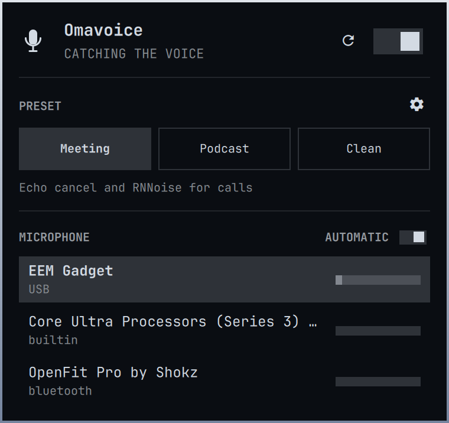
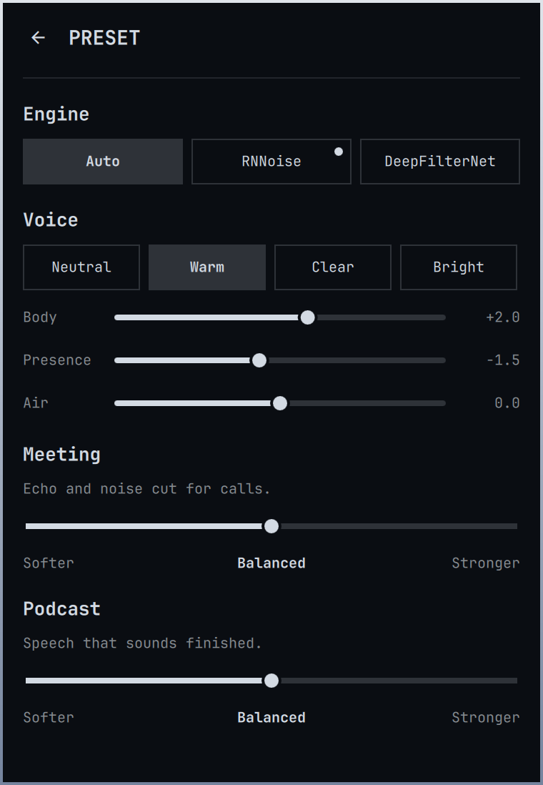

# Omavoice

<p align="center">
  
</p>

<p align="center">
  <strong>Your voice, better heard.</strong><br>
  A virtual microphone for Zoom, Meet, and OBS. One source. Three presets. Noise and echo stay on this side of the call.
</p>

<p align="center">
  <a href="LICENSE"></a>
  
  
  
</p>

<p align="center">
  
  
</p>

Pick **Omavoice** in Zoom, Google Meet, OBS, or a browser. The plugin sits under those apps as a PipeWire source, so you do not configure each one. USB mics attach themselves when you plug them in.

An independent [MIT](LICENSE)-licensed plugin by [GigaSolo](https://github.com/gigasolo) for [Omarchy](https://omarchy.org/) 4 (Quattro). Not affiliated with or endorsed by 37signals.

---

## Presets

| | Meeting | Podcast | Clean |
| --- | --- | --- | --- |
| **For** | Zoom, Meet, Teams | OBS, interviews, local record | Program mixes, music beds |
| **Does** | Monitor-mode AEC + denoise + compressor | High-pass + denoise + compressor | High-pass only |
| **Keeps** | Your voice on a laptop with speakers | Speech that sounds finished | Applause, keys, and music |

Right-click the mark to toggle. Open the panel to switch presets and pick a microphone. The selected mic row shows a live level and a hairline of what Omavoice is sending. Other rows stay quiet so a Bluetooth headset is not grabbed. PRESET tune picks the denoise engine, a Voice look (Neutral / Warm / Clear / Bright) with Body / Presence / Air knobs, and shows which engine is running. On Clean, Voice is visible and disabled.

In the app itself, choose **Omavoice** as the microphone and turn *its* noise cancellation off. Two denoisers stacked sound hollow.

## Install

```sh
omarchy pkg add noise-suppression-for-voice
omarchy plugin add https://github.com/gigasolo/omavoice.git --enable
```

Omarchy may ask which side of the bar to use. The default is the right.

> [!IMPORTANT]
> Plugins run as unsandboxed code inside `omarchy-shell`. Only add repos you trust, and [read the source](https://github.com/gigasolo/omavoice) before you enable one.

Without `--enable`, the plugin is cloned and left off so you can review it first:

```sh
omarchy plugin add https://github.com/gigasolo/omavoice.git
less ~/.config/omarchy/plugins/gigasolo.omavoice/README.md
omarchy plugin enable gigasolo.omavoice --section right
```

From a local checkout:

```sh
omarchy plugin add "$PWD" --enable
```

Do not symlink the checkout into `~/.config/omarchy/plugins` — Omarchy refuses plugins that contain symlinks.

### Optional DeepFilterNet engine

```sh
omarchy pkg aur add libdeep_filter_ladspa-bin
```

**Auto** keeps today’s policy: Meeting uses RNNoise, Podcast uses DeepFilterNet3 when that plugin is present (otherwise RNNoise), Clean is high-pass only. On the PRESET tune page you can pin **RNNoise** or **DeepFilterNet** instead. The engines never stack. If the chosen engine is missing, the panel shows the install command; click **reload** next to on/off after installing. You do not restart the shell.

## Use

| Action | How |
| --- | --- |
| Open or close the panel | Left-click the mark |
| Tune a preset | Settings on PRESET: engine, Voice look, then Softer / Balanced / Stronger |
| Automatic microphone | AUTOMATIC on the MICROPHONE header |
| Toggle Omavoice | Right-click, or `o` |
| Reload processing | Reload next to on/off, or `r` |
| Meeting / Podcast / Clean | `m` / `p` / `c` |
| Move | Arrow keys or `h` `j` `k` `l` |
| Activate | Enter |
| Close | Escape |

USB capture is preferred when it appears, and stereo USB is mixed down to mono. Laptop mics and Bluetooth headsets stay in the picker. Auto stays on the USB you are using if several are plugged in; pin one if you want a specific device.

## How it sits in the graph

```
USB / laptop / BT mic
        │
        ▼
  Omavoice  (pipewire -c, its own client)
   Meeting · Podcast · Clean
        │
        ▼
  Zoom · Meet · OBS · browser
```

The host is a dedicated PipeWire client, the same isolation Omarchy uses for speaker tuning. It does not write into that tuning, and it does not load stock `filter-chain.conf.d`. Disable the plugin and the chain stops.

## While it's running

Meeting echo cancel can use CPU while a call is capturing Omavoice, because it monitors the default sink (speakers or headphones). With no listener the host suspends. Disable the plugin to stop it. Restore goes back to the microphone Omavoice replaced, not to Omavoice itself.

## Update and remove

```sh
omarchy plugin update gigasolo.omavoice
omarchy plugin remove gigasolo.omavoice
```

`omarchy plugin update` shows the diff and fast-forwards the git checkout. Removing the plugin does not change your other audio devices.

## If something is wrong

**The mark is missing.** Confirm it is enabled:

```sh
omarchy plugin list | grep omavoice
omarchy plugin enable gigasolo.omavoice --section right
```

**The panel asks for RNNoise or DeepFilterNet.** Run the command on the setup row (`omarchy pkg add noise-suppression-for-voice` or `omarchy pkg aur add libdeep_filter_ladspa-bin`), then **reload**.

**The app still hears the raw USB mic.** Select **Omavoice** inside Zoom / Meet / OBS, not the hardware device.

**The voice sounds hollow.** The call app is probably denoising too. Turn that off.

## Develop

```sh
git clone https://github.com/gigasolo/omavoice.git
cd omavoice
./tests/run
```

That runs the Model tests and `omarchy plugin validate .`, the same checks Omarchy uses before it will install a plugin.

## Sharing

Omarchy distributes third-party plugins as public git repos. Anyone can run `omarchy plugin add` against this URL.

To help people find it, list it at [plugins.omarchy.org](https://plugins.omarchy.org).

## Changelog

See [CHANGELOG.md](CHANGELOG.md).

## License

[MIT](LICENSE). Copyright (c) 2026 GigaSolo LLC.

```
SPDX-License-Identifier: MIT
```

Omarchy is a trademark of its respective owners.
